# Security Exploitation Report: Cody's First Blog

## Introduction

The "Cody's First Blog" challenge is a security exercise on the HackerOne platform, simulating a simple blog using PHP as a template language. The objective is to exploit security vulnerabilities to bypass login, perform XSS, and ultimately retrieve the flag from the `index.php` file.

## Exploitation Steps

### 1. Starting the Challenge and Initial Observations

Upon starting the challenge, we see the blog interface as shown below:

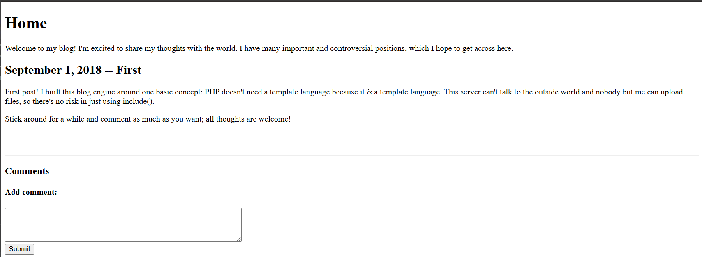

Reading the description of the first blog, we notice:

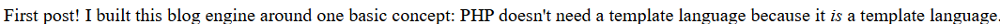

PHP is used as a template language. We attempt to post a comment to test:

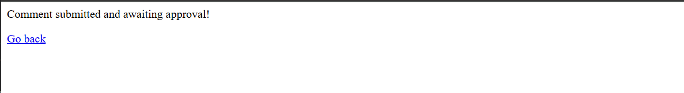

The comment does not appear because it has not been approved by the admin. When viewing the source code (View Source), we see a href link like this:

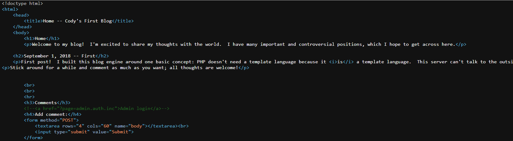

This link contains the parameter `?page=admin.auth.inc`, indicating that the application uses `include` to load files based on the `page` parameter.

### 2. Bypassing Login

The `page` parameter appears to be included directly. We try changing its value to bypass authentication:

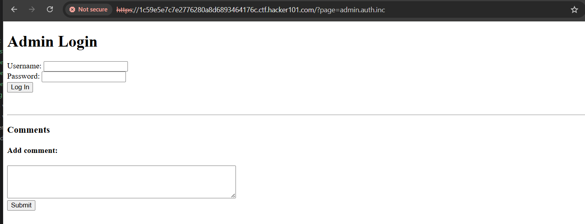

Assuming the value of `page` is included, we can find a way to bypass the login. After trying SQL injection and other techniques without success, we notice the file name `admin.auth.inc`. What happens if we ignore the `auth` part?

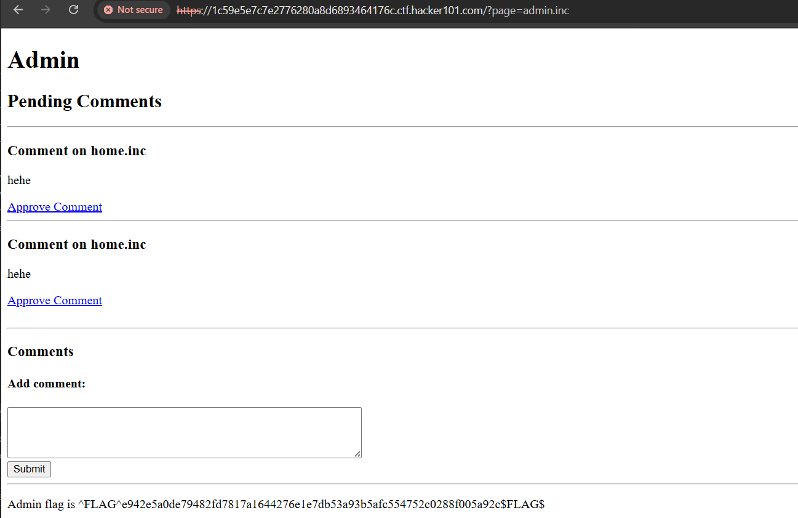

By changing the `page` parameter to `admin.inc` (removing `auth`), we successfully bypass the admin login.

### 3. Approving Comments and Testing XSS

After bypassing, we approve the submitted comment and return to the first page:

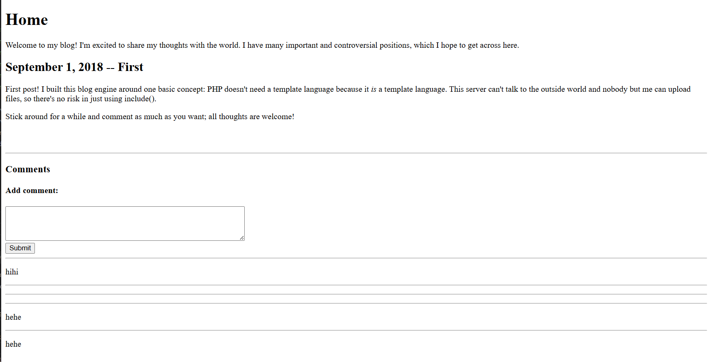

Here, we know we can test XSS, but it does not display the flag. We try submitting simple PHP code:

```php
<?php echo "hello" ?>
```

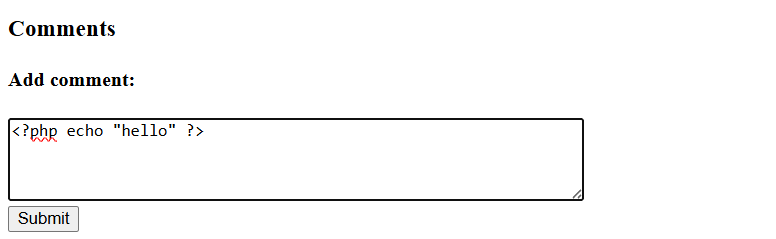

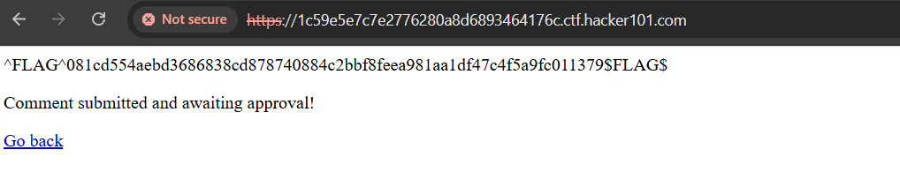

### 4. Reading index.php to Obtain the Flag

Observing the value of the `page` parameter, if we enter an arbitrary value, the web server will include that value and append the `.php` extension. Testing as follows:

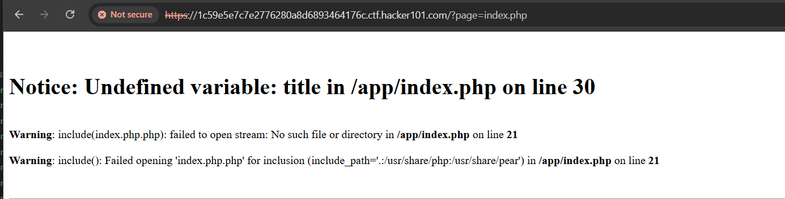

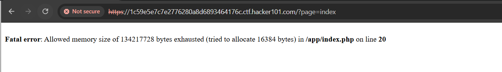

We try other techniques like `../../../etc/password%00`, `file:///etc/password%00`, file wrapper include, but they are ineffective. When trying `index` for the `page` parameter, we see:

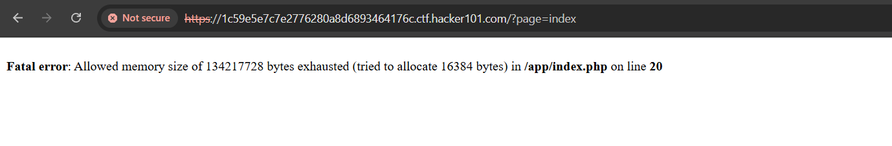

Is there a way to bypass and read the `index.php` file? We try submitting PHP code that executes a command:

```php
<?php echo system('cat index.php') ?>
```

After approval, this code will appear in `index.php`. But previous solutions are ineffective. We try entering the collaborator URL to check for DNS traffic:

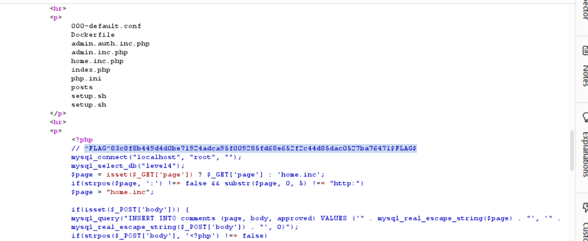

This indicates that the web server can include from external websites. We try `http://localhost/index`, and successfully read the flag from the source code of `index.php`.

## Conclusion

This challenge exploits a Local File Inclusion (LFI) vulnerability through the `page` parameter, allowing login bypass, XSS execution, and ultimately reading sensitive files to obtain the flag. Necessary security measures include validating and sanitizing input, using whitelists for includable files, and avoiding exposure of sensitive parameters.
