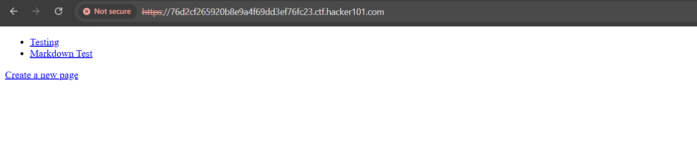
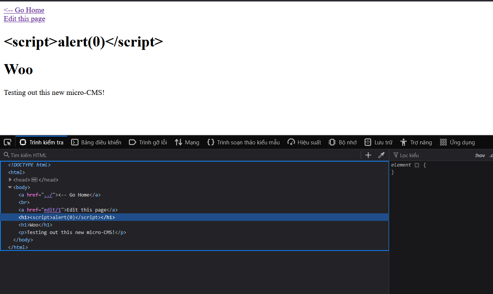
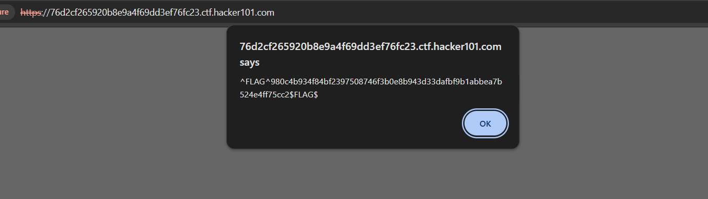
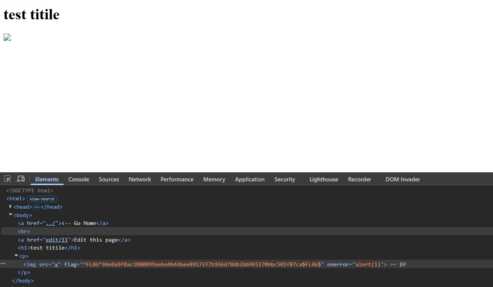
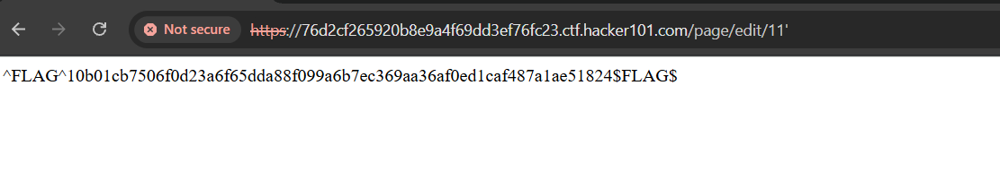
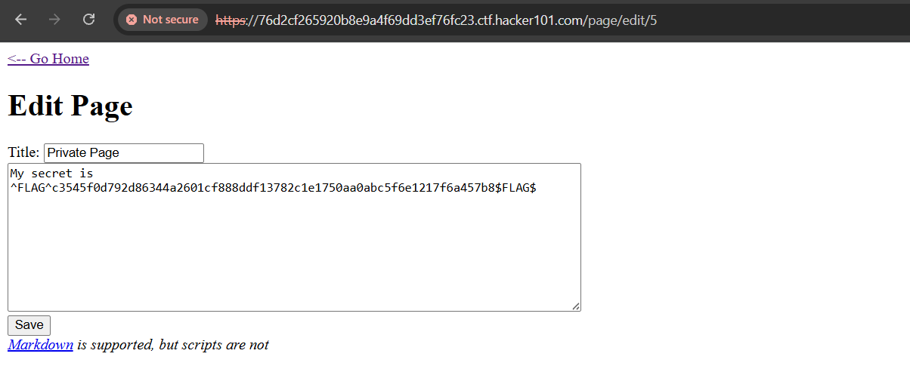

# Micro-CMS v1 Challenge Writeup

## Introduction

This is an easy challenge involving various web vulnerabilities.

## Flag 1: XSS in Title

1. Go to the testing page and inject the payload ``.
2. The payload appears as text on the page, but it doesn't mean XSS doesn't work.
3. Navigate to the home page to see the flag.

The flag appears because the title is inserted into an HTML tag.

## Flag 2: XSS in Body

1. Edit the body content in the edit page.
2. Use the payload ``.

## Flag 3: SQL Injection in URL

1. The URL `page/edit/[id]` is vulnerable to SQL injection.
2. Inject a single quote `'` into the ID to reveal the flag.

## Flag 4: IDOR Vulnerability

1. Accessing `GET /page/5` returns a 403 Forbidden error.
2. However, `GET /page/edit/5` allows viewing the content.

This is an Insecure Direct Object Reference (IDOR) flaw.
