# Photo Gallery Challenge Writeup

## Introduction

This challenge involves SQL injection and command injection vulnerabilities.

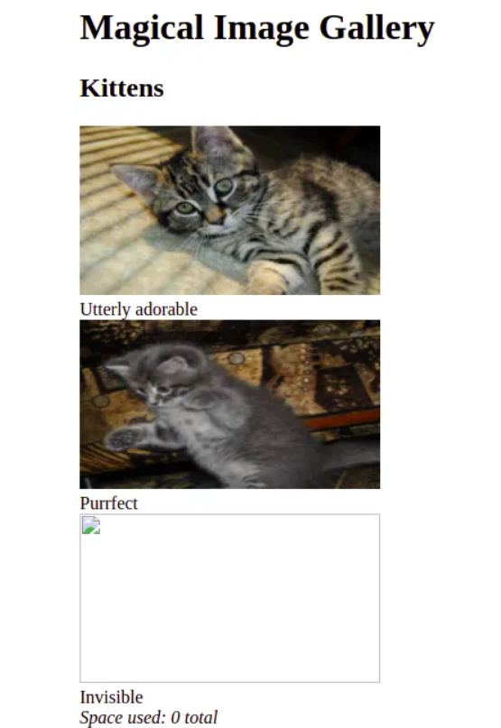

## Flag 1: SQL Injection

1. Navigate to the view page.

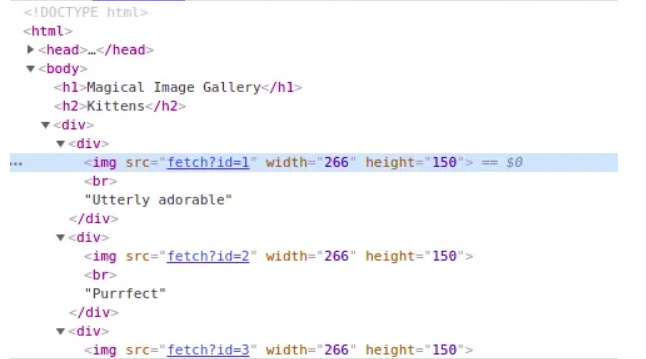

The app fetches data from the backend.

2. Use BurpSuite to intercept requests.

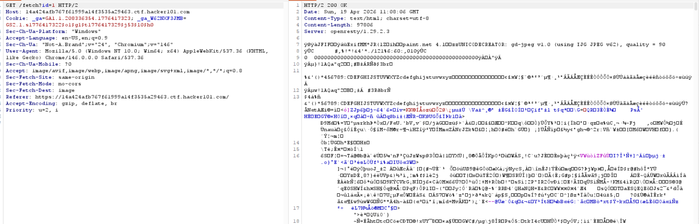

3. Test for SQL injection and observe responses.

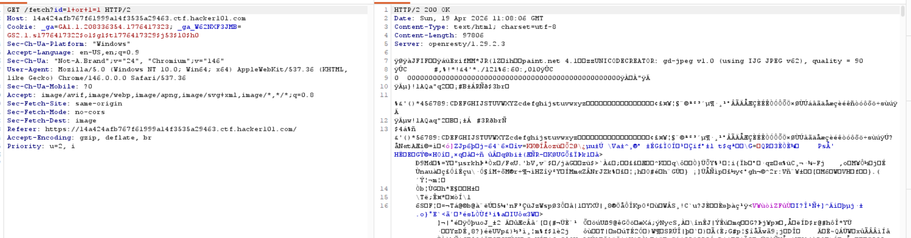

4. Use sqlmap to dump the database.

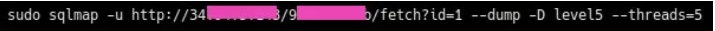
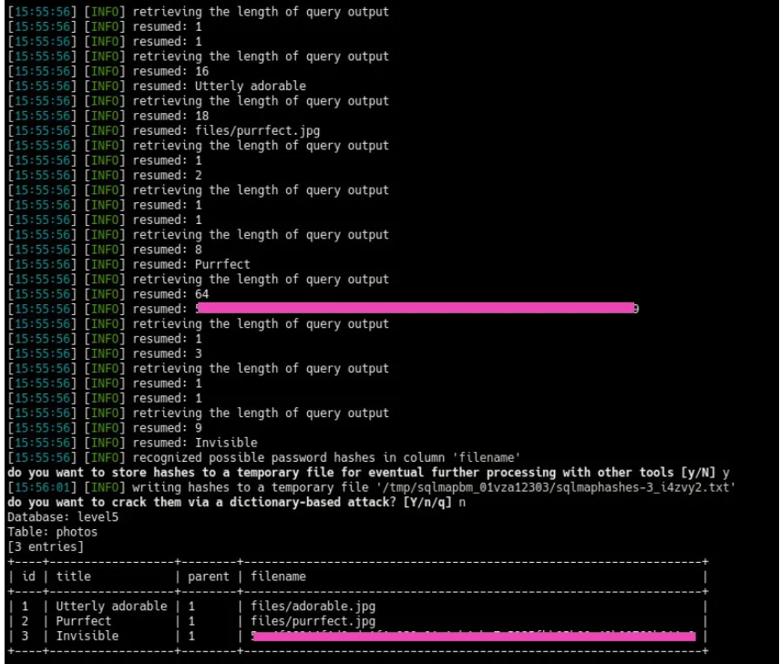

## Flag 2: Union-Based SQL Injection

1. Unable to find exploitation method initially, so check the hint.

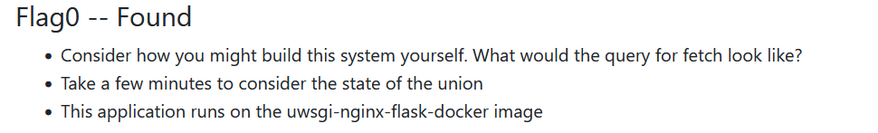

Hint: "This is the third hint."

2. Search online for similar structures.

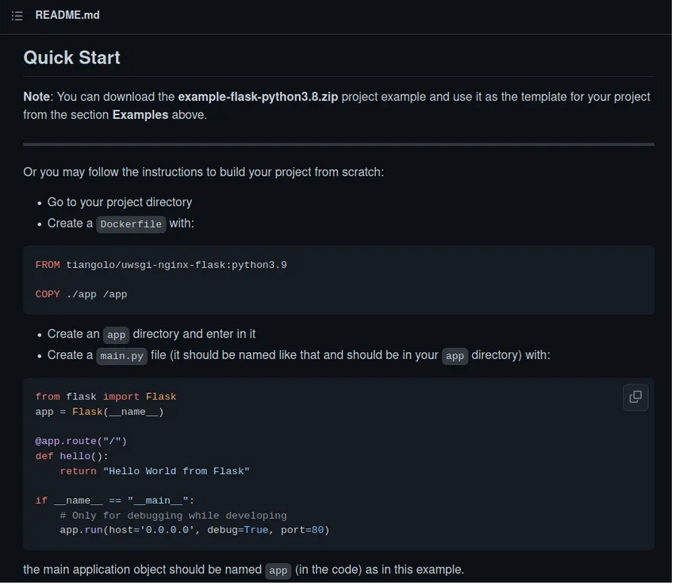

Resembles Docker image structure.

3. Modify the query accordingly.

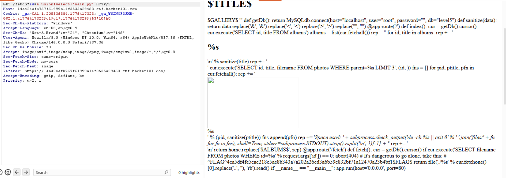

## Flag 3: Command Injection

1. Review the code.

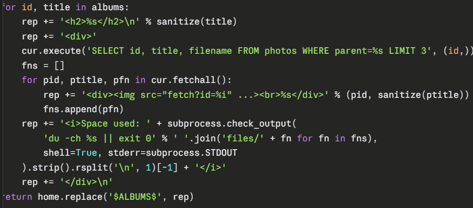

Uses `subprocess.check_output` to join files/filenames for usage calculation – vulnerable to OS command injection.

2. Inject stacked queries:

   ```
   fetch?id=3; UPDATE photos SET filename=";echo $(ls)" WHERE id=3; commit;
   ```

3. No flag visible.

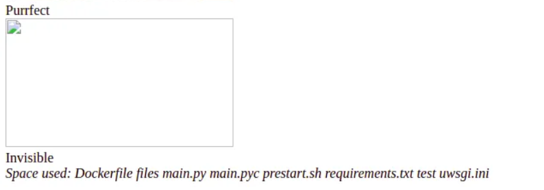

4. Hint: "Be aware of your environment."
   - Search for Linux environment variables: https://www.cyberciti.biz/faq/linux-list-all-environment-variables-env-command/
   - `printenv` shows all environment variables.

5. Updated payload:
   ```
   fetch?id=3; UPDATE photos SET filename=";echo $(printenv)" WHERE id=3; commit;
   ```

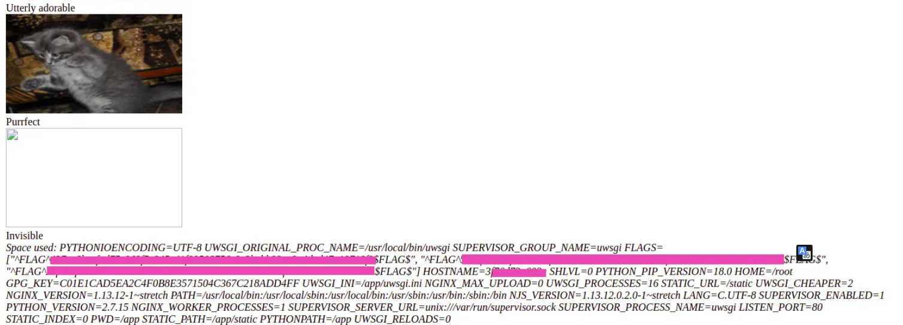
